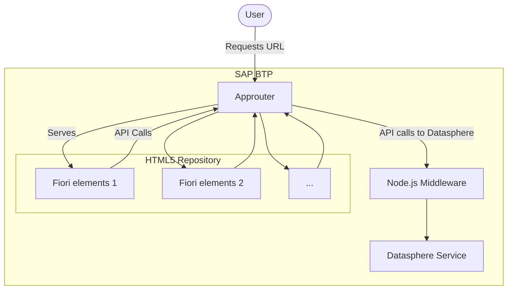

# Maxeda Datasphere reporting project

The goal of this project is to visualize data coming from SAP Datasphere into one or multiple Fiori Elements applicatios.
Each report, provided by the functional team, will have a unique Fiori Elements project that will provide the visualization.
A NodeJS middleware will make it possible for Fiori Elements to communicate with the SAP Datasphere API. The middleware will be used in a generic manner, so that we only need one middleware for all the Fiori elements applications.

# Project components

- Local approuter: Only used for testing on a local device. The approuter will not be deployed to BTP. We will use the built-in managed approuter.
- NodeJS middleware, using the Express framework. The middleware provides communication between Datasphere API and Fiori elements report. One of the reasons why we need this, is the fact that Fiori Elements with OData V4 is using Batch requests. We cannot disable this. Currently the Datasphere API doesn't support BATCH calls.
- Fiori elements applications.

# Prerequisites
- Install the CF CLI: https://docs.cloudfoundry.org/cf-cli/install-go-cli.html
- Install the MBT tooling: https://help.sap.com/docs/hana-cloud-database/sap-hana-cloud-sap-hana-database-developer-guide-for-cloud-foundry-multitarget-applications-sap-web-ide-full-stack/cloud-mta-build-tool-mbt
- Install HTML5 plugin: https://sap.github.io/cf-html5-apps-repo-cli-plugin/
- install SAP CDS CLI: https://cap.cloud.sap/docs/tools/cds-cli
- 

# Running the project locally - Initial setup
- Clone this project
- Perform npm install in 
  - root of the project
  - /localapprouter
  - /srv
  - /ui
- Login with the CF cli. (We provided a script for this in the root package.json: npm run cflogin)
- Target to the right subaccount and spaces: npm run cftarget
- From the root folder:
  - Bind destination service:
    - cds bind -2 datareports-poc-destination-service
  - Bind XSUAA service:
    - cds bind -2 datareports-xsuaa-service

# Running the project locally

- In vs code, run the following start scripts:
  - Start local approuter
  - Start middleware
  - Start *relevant frontend app you want to test*
- The approuter will run on port 5000
- The frontend app will run on port 8080
- The middleware will run on port 3000
- Now go to https://localhost:5000/ui5/index.html
- Choose IDP a1bsy3peq and log in
- The fiori app should be loading. Make sure to select columns in the settings panel and to press go.

# Local endpoints:

Fiori app: https://localhost:5000/ui/index.html

Metadata of Datasphere api loaded via local approuter: https://localhost:5000/srv_api/datasphere/dwc/consumption/analytical/VANDEK13/Sales_Demo_Analytical_Model/$metadata?sap-language=EN

